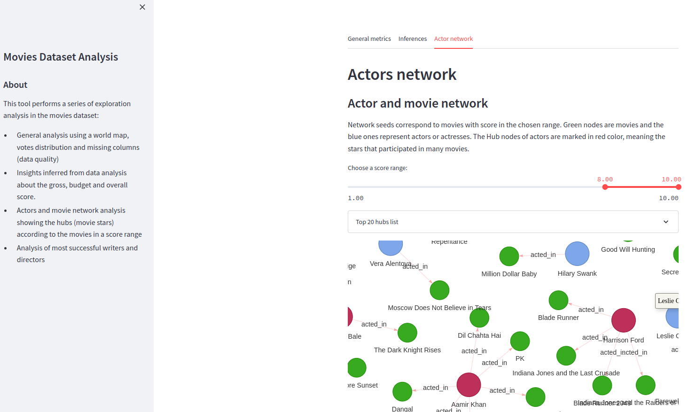

# Movies Dataset Dashboard in Streamit

## Summary
This tool performs a series of exploration analysis in the movies dataset: 
- General analysis using a world map, votes distribution and missing columns (data quality)
- Insights inferred from data analysis about the gross, budget and overall score.  
- Actors and movie network analysis showing the hubs (movie stars) according to the movies in a score range
- Analysis of most successful writers and directors 

<div style="text-align: center">
	
</div>

## Requirements:
* Python packages needed:
    - pip3 install streamlit
	- pip3 install plotly
	- pip3 install matplotlib
	- pip3 install pandas
	- pip3 install imdb
	- pip3 install streamlit_agraph

## Usage Instructions
* Preparation:
	1. ````git clone https://github.com/YasCoMa/dashboard-streamlit-movies.git````
	2. ````cd dashboard-streamlit-movies````
	3. ````streamlit run run.py````
